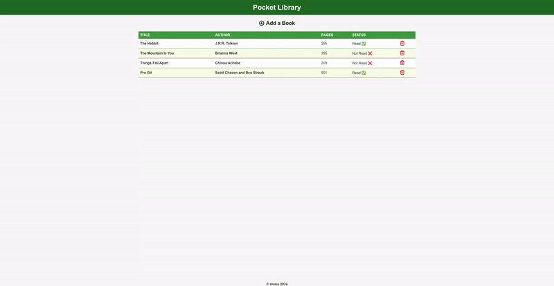

# Project: Library
Pocket Library is a minimalist web-based application that allows users to manage their personal book collection. It lets you add, remove, and update the reading status of books in an intuitive and user-friendly interface.

## Features

- Add Books: Quickly add books to your library with title, author, and reading status.

- Remove Books: Delete unwanted books from your collection.

- Toggle Reading Status: Update whether a book has been read or not with a single click.

- Responsive Design: Works on desktop and mobile browsers *(coming soon)*

## How It Works

- Add a new book by filling out the form with the title, author, and reading status.

- View your collection displayed as a table.

- Use the "Read/Not Read" button to toggle the reading status of a book.

- Click the trash icon to delete a book from the library.

## Built With

- **HTML**: Structure and layout of the app.

- **CSS**: Styling for a clean and responsive design.

- **JavaScript**: Core functionality, including adding, removing, and updating books.

## App Demo

## Challenges Faced

- Implementing event delegation for dynamically added elements.

- Debugging the logic for toggling the reading status.

- Ensuring proper DOM manipulation for a seamless user experience.

## Lessons Learned

- Improved understanding of DOM manipulation with JavaScript.

- Enhanced ability to debug and handle dynamically created elements.

- Gained insights into user experience and interface design.

## Future Enhancements

- Add book cover images.

- Implement sorting and filtering options.

- Store library data in localStorage or a database for persistence.

- Add search functionality to find books quickly.